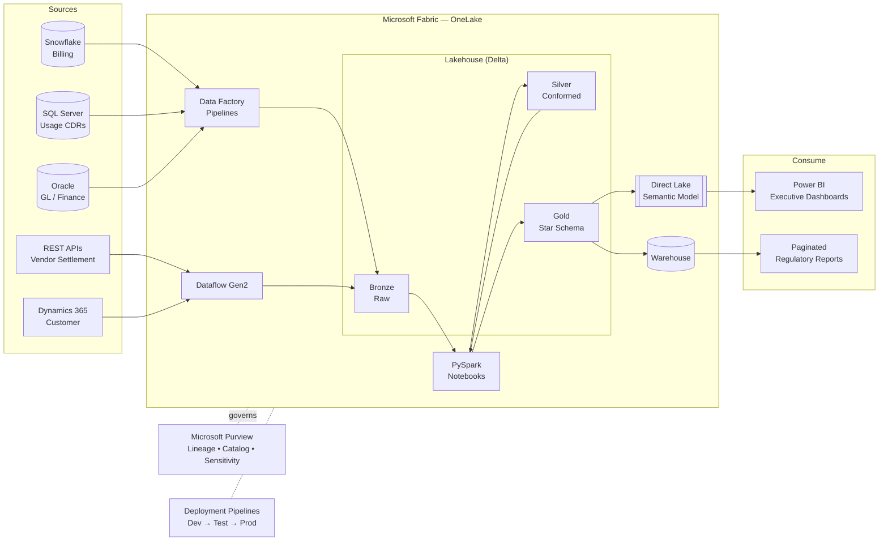

# Microsoft Fabric — Enterprise Revenue & Cost Assurance Analytics

> End-to-end analytics platform built on Microsoft Fabric (OneLake + Lakehouse + Direct Lake) delivering Revenue Assurance, Cost Assurance, and Finance KPI reporting for a Telecom enterprise. Ingests multi-source data, transforms it through a medallion (Bronze → Silver → Gold) architecture, and serves a Direct Lake semantic model to executive Power BI dashboards on billion-row datasets within sub-second SLAs.


---

## Table of Contents

1. [Business Context](#1-business-context)
2. [Solution Overview](#2-solution-overview)
3. [Architecture](#3-architecture)
4. [Medallion Lakehouse Design](#4-medallion-lakehouse-design)
5. [Data Pipeline Flow](#5-data-pipeline-flow)
6. [Dataflow Gen2 Ingestion](#6-dataflow-gen2-ingestion)
7. [Direct Lake Semantic Model](#7-direct-lake-semantic-model)
8. [Advanced DAX](#8-advanced-dax)
9. [Governance & Security](#9-governance--security)
10. [Capacity (CU) Sizing](#10-capacity-cu-sizing)
11. [KPI Catalog](#11-kpi-catalog)
12. [Repository Structure](#12-repository-structure)
13. [Results](#13-results)

---

## 1. Business Context

The Finance and Revenue Assurance organization needed a single governed analytics platform to replace a fragmented mix of Snowflake extracts, manual Excel reconciliations, and siloed Power BI imports. Key problems:

- **Revenue leakage** went undetected for 30–45 days because billing-vs-usage reconciliation ran monthly in spreadsheets.
- **Cost assurance** (interconnect, roaming, vendor settlement) had no line-of-sight at the executive level.
- Reports refreshed slowly (8–12 minutes) and frequently timed out on high-cardinality subscriber data.
- No certified single source of truth — three teams reported three different "monthly revenue" numbers.

**Goal:** a Fabric-native medallion platform feeding one **certified Direct Lake semantic model**, with daily (near-real-time on critical feeds) refresh, row-level security per business unit, and sub-second executive dashboards.

## 2. Solution Overview

| Layer | Technology | Purpose |
|-------|-----------|---------|
| Ingestion | Fabric Data Factory pipelines + Dataflow Gen2 | Multi-source extraction (Snowflake, SQL Server, Oracle, REST APIs, Dynamics 365) |
| Storage | OneLake + Lakehouse (Delta) | Single logical data lake, medallion zones |
| Transform | PySpark Notebooks + Dataflow Gen2 (M) | Cleansing, conforming, business rules, SCD |
| Serve | Warehouse + Direct Lake semantic model | Governed star schema for BI |
| Consume | Power BI (Direct Lake) | Executive dashboards, paginated regulatory reports |
| Govern | Microsoft Purview, Deployment Pipelines, RLS/OLS | Lineage, certification, security, CI/CD |

## 3. Architecture

See [`docs/architecture.md`](docs/architecture.md) for the full diagram and component-by-component walkthrough.



## 4. Medallion Lakehouse Design

See [`docs/lakehouse-flow.md`](docs/lakehouse-flow.md) for table-level detail.

- **Bronze (raw):** exact source copies as Delta, append-only, with ingestion metadata (`_source_system`, `_load_ts`, `_batch_id`, `_file_name`). No business logic.
- **Silver (conformed):** deduplicated, type-cast, standardized keys, data-quality flags, SCD Type 2 on dimensions. One row = one business entity event.
- **Gold (presentation):** Kimball star schema — conformed dimensions and additive fact tables tuned for VertiPaq and Direct Lake. This is what the semantic model reads.

## 5. Data Pipeline Flow

See [`docs/data-pipeline-flow.md`](docs/data-pipeline-flow.md). Orchestration uses a parameterized metadata-driven pattern: a control table drives a `ForEach` over source entities, each running `Lookup → Copy → Notebook (transform) → validate → log`. Incremental loads use **watermark/CDC**; failures route to dead-letter and emit Purview-visible run logs.

## 6. Dataflow Gen2 Ingestion

Reusable Power Query (M) entities for low-code sources. See [`dataflows/`](dataflows/) for the annotated M scripts (REST API pagination, Snowflake incremental pull, schema enforcement, error handling).

## 7. Direct Lake Semantic Model

A certified Direct Lake model over the Gold Delta tables — no import, no scheduled dataset refresh, query folding straight to OneLake. See [`docs/semantic-model.md`](docs/semantic-model.md) for the model diagram, relationships, storage mode decisions, and the fallback-to-DirectQuery guardrails.

## 8. Advanced DAX

The full measure library lives in [`dax/measures.dax`](dax/measures.dax) and calculation groups in [`dax/calculation-groups.dax`](dax/calculation-groups.dax). Highlights: time intelligence (YTD/MTD/QoQ/YoY/parallel period), revenue-leakage variance, RANKX segmentation, dynamic measure switching, and format-string-driven calc groups.

## 9. Governance & Security

Microsoft Purview for lineage and sensitivity labels; RLS by business unit and OLS on PII columns; certified-dataset endorsement; Deployment Pipelines for Dev → Test → Prod promotion. Mapped to SOX, GDPR, and Regulation W controls. Detail in [`docs/governance.md`](docs/governance.md).

## 10. Capacity (CU) Sizing

F-SKU sizing methodology, workload split, and the monitoring approach (Capacity Metrics app, throttling thresholds) in [`docs/capacity-sizing.md`](docs/capacity-sizing.md).

## 11. KPI Catalog

Business definitions, grain, owner, and DAX measure name for every executive KPI in [`docs/kpi-catalog.md`](docs/kpi-catalog.md).

## 12. Repository Structure

```
01-Microsoft-Fabric-Enterprise-Analytics/
├── README.md
├── docs/
│   ├── architecture.md
│   ├── lakehouse-flow.md
│   ├── data-pipeline-flow.md
│   ├── semantic-model.md
│   ├── governance.md
│   ├── capacity-sizing.md
│   └── kpi-catalog.md
├── notebooks/
│   ├── 01_bronze_ingest.py
│   ├── 02_silver_conform.py
│   └── 03_gold_star_build.py
├── sql/
│   └── gold_warehouse_views.sql
├── dax/
│   ├── measures.dax
│   └── calculation-groups.dax
└── dataflows/
    ├── dfg2_snowflake_billing.m
    └── dfg2_rest_vendor_settlement.m
```

## 13. Results

| Metric | Before | After |
|--------|--------|-------|
| Executive dashboard load time | 8–12 min | < 1 sec (Direct Lake) |
| Revenue leakage detection lag | 30–45 days | < 24 hours |
| Reconciliation effort | ~120 hrs/month manual | Automated, ~6 hrs review |
| Source-of-truth disputes | 3 conflicting numbers | 1 certified dataset |
| Capacity cost | Over-provisioned P1 | Right-sized F64, ~22% lower |

---

*Built as a hands-on Microsoft Fabric implementation covering OneLake, Lakehouse, Direct Lake, Dataflow Gen2, semantic modeling, governance, and executive KPI dashboards.*
